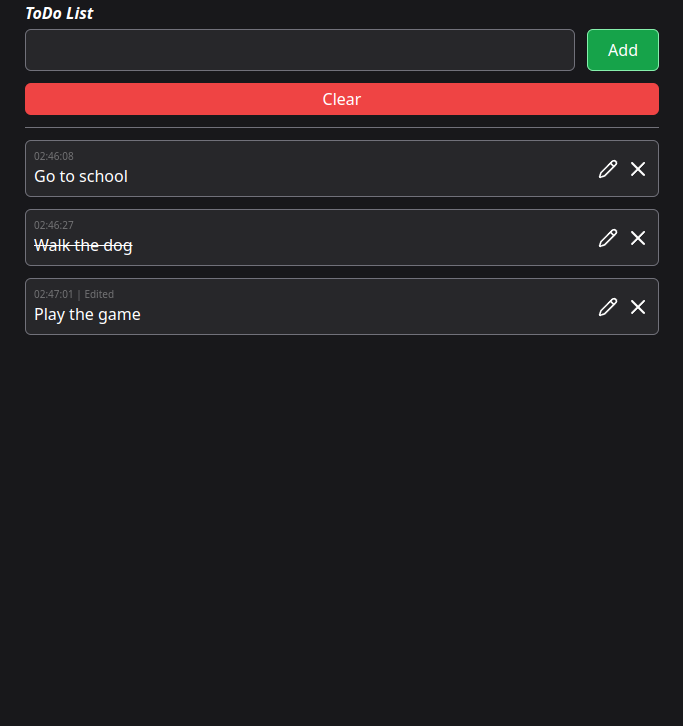

# React Todo List

This project is a simple Todo List application developed to better understand React. The application allows users to create, edit, and delete tasks on their to-do list.

## Technologies Used

- **Tailwind CSS**: For styling and layout.
- **Lucide React**: As an icon set.
- **UUID**: For generating unique identifiers.
- **Auto Animate**: For animations.

#

